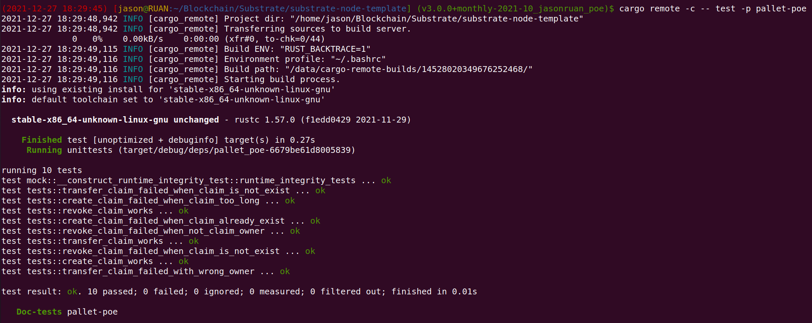
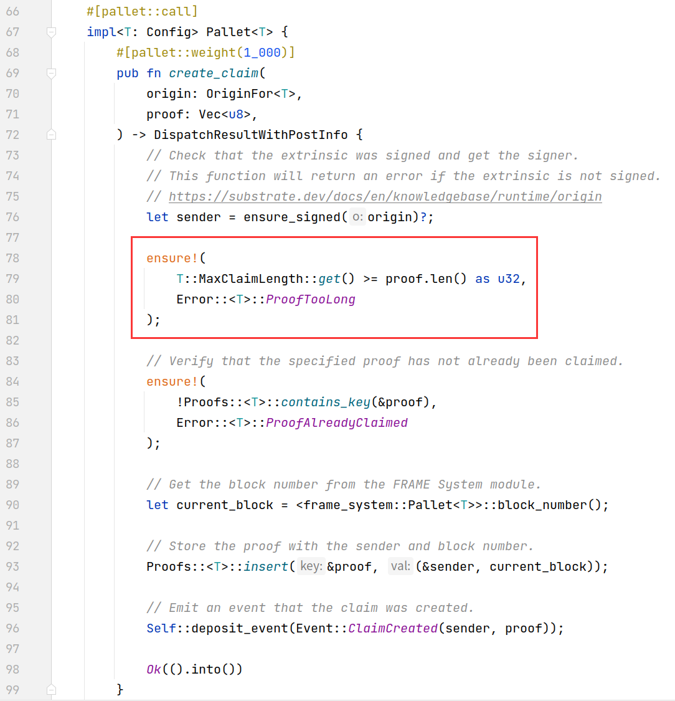
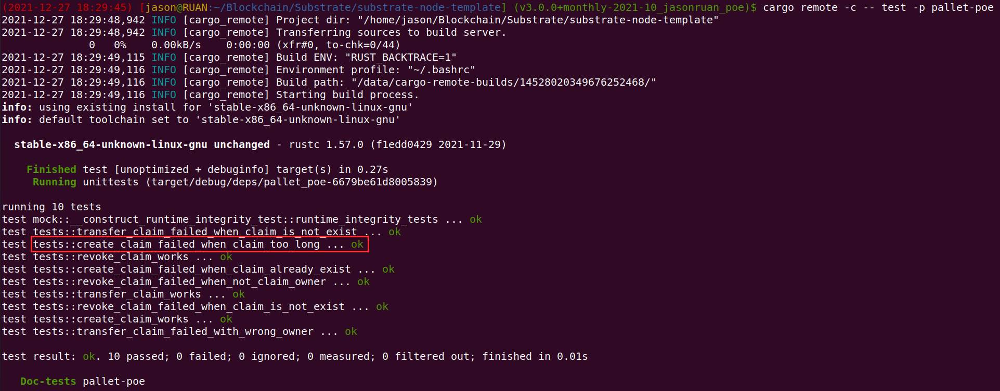

## 04 编写存证模块的单元测试代码

### 创建存证的测试用例

```rust
#[test]
fn create_claim_works() {
    new_test_ext().execute_with(|| {
        let claim = vec![1, 2, 3, 4];
        assert_ok!(PoeModule::create_claim(Origin::signed(1), claim.clone()));
        assert_eq!(
            Proofs::<Test>::get(&claim),
            (1u64, frame_system::Pallet::<Test>::block_number())
        );
    })
}

#[test]
fn create_claim_failed_when_claim_already_exist() {
    new_test_ext().execute_with(|| {
        let claim = vec![1, 2, 3, 4];
        let _ = PoeModule::create_claim(Origin::signed(1), claim.clone());
        assert_noop!(
            PoeModule::create_claim(Origin::signed(1), claim.clone()),
            Error::<Test>::ProofAlreadyClaimed
        );
    })
```

### 撤销存证的测试用例

```rust
#[test]
fn revoke_claim_works() {
    new_test_ext().execute_with(|| {
        let claim = vec![1, 2, 3, 4];
        let _ = PoeModule::create_claim(Origin::signed(1), claim.clone());

        assert_ok!(PoeModule::revoke_claim(Origin::signed(1), claim.clone()));
        // assert_eq!(Proofs::<Test>::get(&claim), None);
        assert_eq!(PoeModule::proofs(&claim), (0, 0));
    })
}

#[test]
fn revoke_claim_failed_when_claim_is_not_exist() {
    new_test_ext().execute_with(|| {
        let claim = vec![1, 2, 3, 4];

        // 返回错误，对链上状态不进行任何修改
        assert_noop!(
            PoeModule::revoke_claim(Origin::signed(1), claim.clone()),
            Error::<Test>::NoSuchProof
        );
    })
}

// 撤销存证不是本人
#[test]
fn revoke_claim_failed_when_not_claim_owner() {
    new_test_ext().execute_with(|| {
        let claim = vec![1, 2, 3, 4];
        let _ = PoeModule::create_claim(Origin::signed(1), claim.clone());

        assert_noop!(
            PoeModule::revoke_claim(Origin::signed(2), claim.clone()),
            Error::<Test>::NotProofOwner
        );
    })
}
```

### 转移存证的测试用例

```rust
// 成功转移存证
#[test]
fn transfer_claim_works() {
    new_test_ext().execute_with(|| {
        let claim = vec![1, 2, 3, 4];
        let _ = PoeModule::create_claim(Origin::signed(1), claim.clone());

        assert_ok!(PoeModule::transfer_claim(
            Origin::signed(1),
            claim.clone(),
            2
        ));
        assert_eq!(
            Proofs::<Test>::get(&claim),
            (2u64, frame_system::Pallet::<Test>::block_number())
        );
    })
}

// 转移存证失败=>存证不存在
#[test]
fn transfer_claim_failed_when_claim_is_not_exist() {
    new_test_ext().execute_with(|| {
        let claim = vec![0, 1];

        assert_noop!(
            PoeModule::transfer_claim(Origin::signed(1), claim.clone(), 2),
            Error::<Test>::NoSuchProof
        );
    })
}

// 转移存证失败=>存证非所有者
#[test]
fn transfer_claim_failed_with_wrong_owner() {
    new_test_ext().execute_with(|| {
        let claim = vec![0, 1];

        let _ = PoeModule::create_claim(Origin::signed(1), claim.clone());

        assert_noop!(
            PoeModule::transfer_claim(Origin::signed(2), claim.clone(), 3),
            Error::<Test>::NotProofOwner
        );
    })
}
```

### 测试结果



## 05 创建存证时，为存证内容的哈希值 Vec

### 设置长度上限，超过限制时返回错误



### 编写测试用例

```rust
// 存证内容过长异常
#[test]
fn create_claim_failed_when_claim_too_long() {
    new_test_ext().execute_with(|| {
        let claim = vec![0, 1, 2, 3, 4, 5];
        assert_noop!(
            PoeModule::create_claim(Origin::signed(1), claim.clone()),
            Error::<Test>::ProofTooLong,
        );
    });
}
```

### 测试结果

