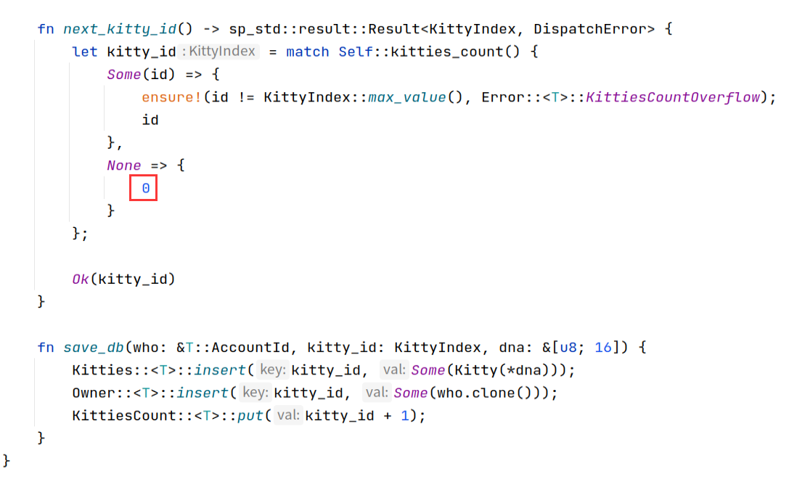
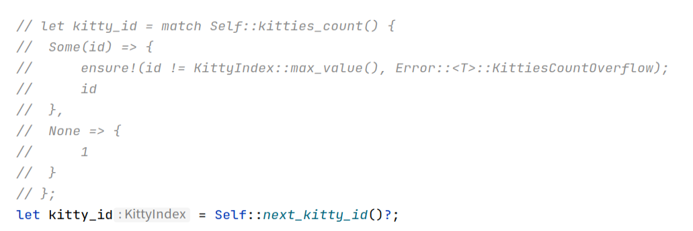
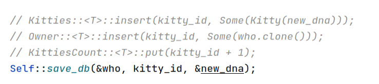
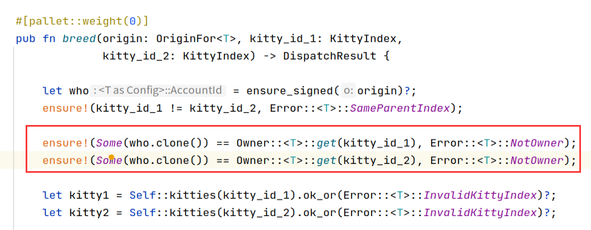
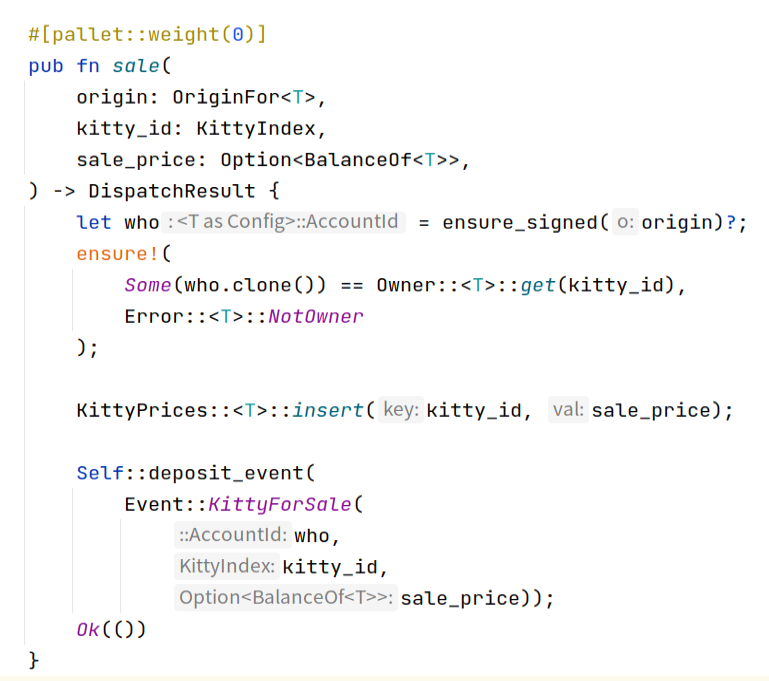
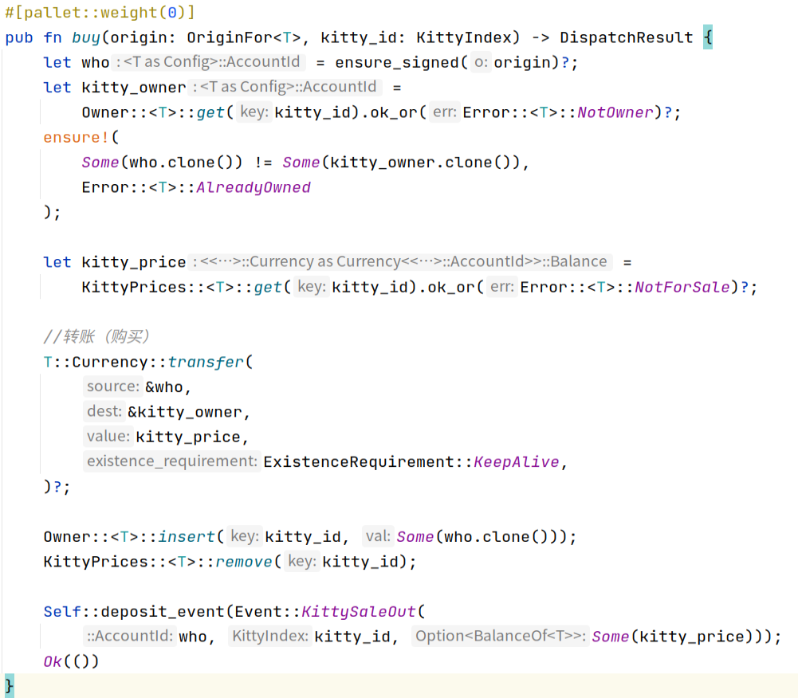

编程作业，需要完成以下要求并且提交代码链接： 

## 1 增加买和卖的extrinsic，对视频中kitties的实现进行重构，提取出公共代码

### 代码重构

- 抽离公共方法
- 起始ID改为0

- 使用公共方法

- 繁殖增加猫咪归属Owner的判断

### 卖

### 买

## KittyIndex不在pallet中指定，而是在runtime里面绑定

## 测试代码能测试所有的五个方法，能检查所有定义的event，能测试出所有定义的错误类型

## 引入Balances里面的方法，在创建时质押一定数量的token，在购买时支付token