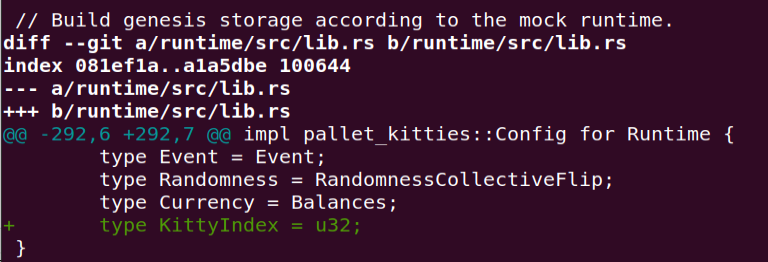
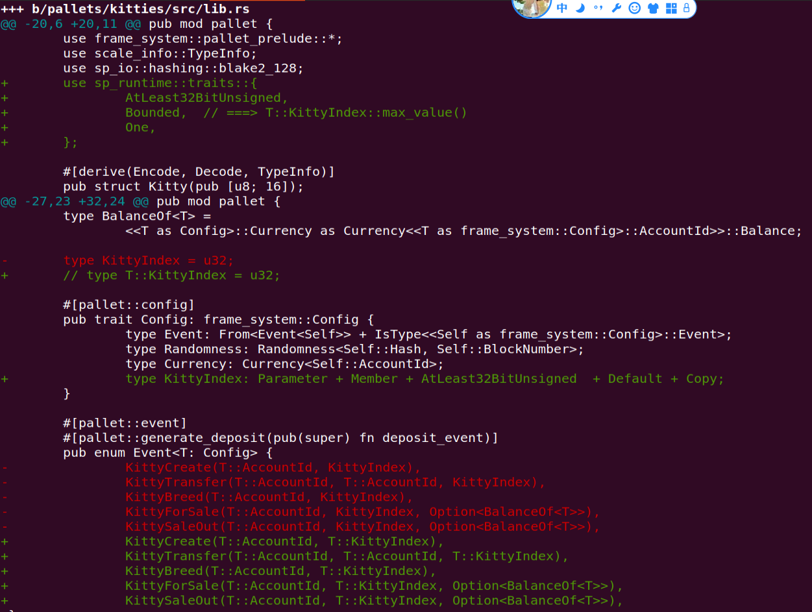
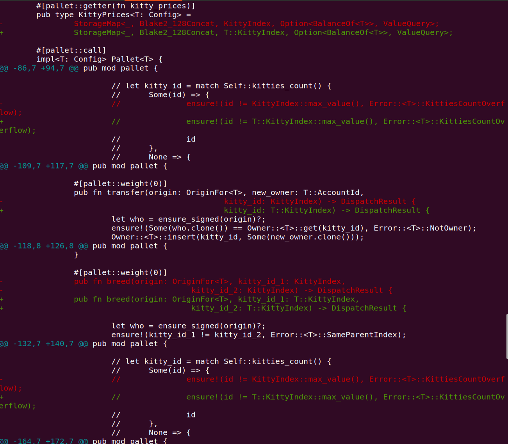
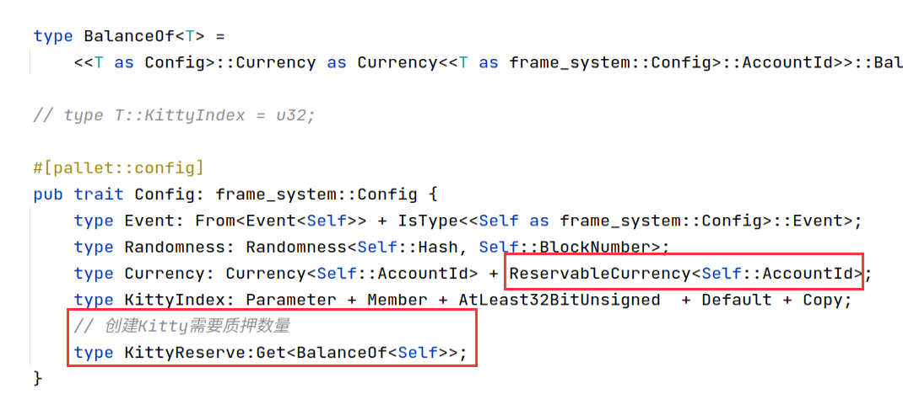
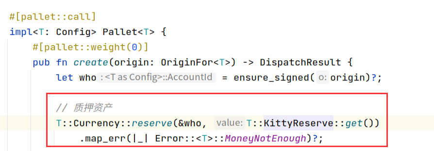
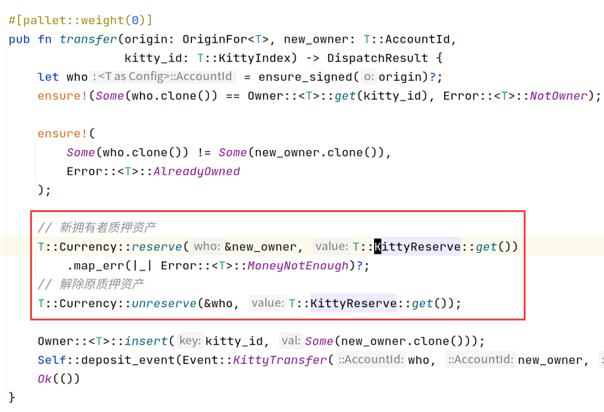
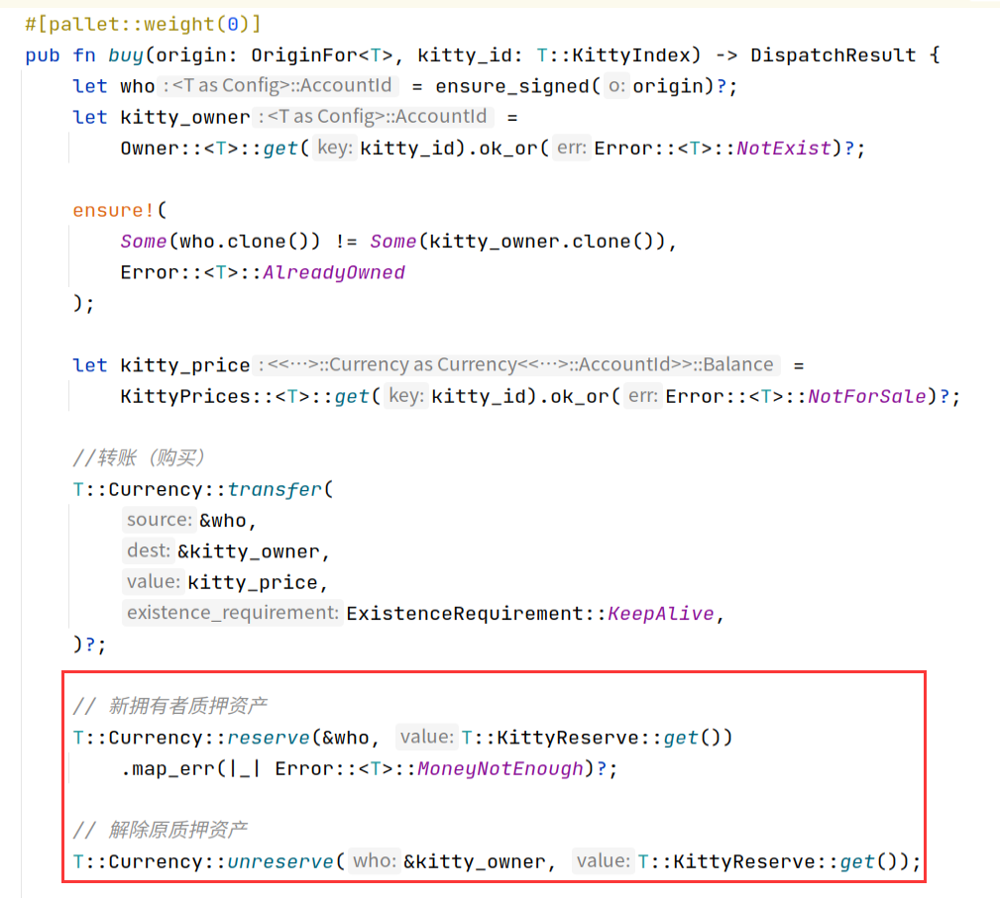
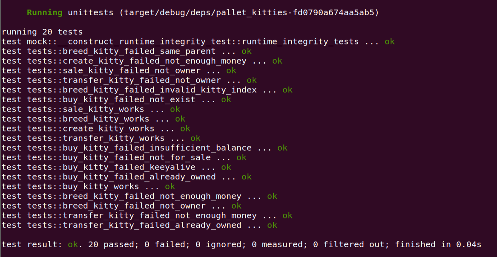

编程作业，需要完成以下要求并且提交代码链接： 

[TOC]


## 1 增加买和卖的extrinsic，对视频中kitties的实现进行重构，提取出公共代码

### 代码重构

- 抽离公共方法
- 起始ID改为0


- 使用公共方法


- 繁殖增加猫咪归属Owner的判断


### 卖


### 买


## 2 KittyIndex不在pallet中指定，而是在runtime里面绑定








## 3 测试代码能测试所有的五个方法，能检查所有定义的event，能测试出所有定义的错误类型

### (1) 创建Kitty
#### (1.1) 成功创建Kitty
```rust
#[test]
fn create_kitty_works() {
    new_test_ext().execute_with(|| {
        assert_ok!(KittiesModule::create(Origin::signed(ALICE)));
        System::assert_last_event(
            mock::Event::KittiesModule(crate::Event::KittyCreate(
            ALICE, KITTY_1,
        )));

        assert_ok!(KittiesModule::create(Origin::signed(BOB)));
        System::assert_last_event(
            mock::Event::KittiesModule(crate::Event::KittyCreate(
                BOB, KITTY_2,
            )));
        assert_eq!(KittiesCount::<Test>::try_get(), Ok(2));

        assert_eq!(Owner::<Test>::try_get(KITTY_1).unwrap().unwrap(), ALICE);
        assert_eq!(Owner::<Test>::try_get(KITTY_2), Ok(Some(BOB)));

        //检查质押数量
        assert_eq!(Balances::reserved_balance(ALICE), KITTY_RESERVE);
        assert_eq!(Balances::reserved_balance(BOB), KITTY_RESERVE);
    })
}
```

#### (1.2) 创建Kitty失败，余额不足以质押
```rust
#[test]
fn create_kitty_failed_not_enough_money() {
    new_test_ext().execute_with(|| {
        assert_noop!(
            KittiesModule::create(Origin::signed(NEO)),
            Error::<Test>::MoneyNotEnough
        );
    })
}
```

### (2) 转移Kitty
#### (2.1) 成功转移Kitty
```rust
#[test]
fn transfer_kitty_works() {
    new_test_ext().execute_with(|| {
        创建猫咪
        assert_ok!(KittiesModule::create(Origin::signed(ALICE)));

        assert_eq!(KittiesCount::<Test>::get(), 1);
        assert_eq!(Owner::<Test>::try_get(KITTY_1), Ok(Some(ALICE)));

        检查质押数量
        assert_eq!(Balances::reserved_balance(ALICE), KITTY_RESERVE);

        转移猫咪
        assert_ok!(KittiesModule::transfer(Origin::signed(ALICE), BOB, KITTY_1));

        检查事件
        System::assert_last_event(mock::Event::KittiesModule(crate::Event::KittyTransfer(
            ALICE, BOB, 0,
        )));

        查看猫咪当前归属
        assert_eq!(KittiesCount::<Test>::get(), 1);
        assert_eq!(Owner::<Test>::try_get(KITTY_1), Ok(Some(BOB)));

        检查质押数量
        assert_eq!(Balances::reserved_balance(ALICE), 0);
        assert_eq!(Balances::reserved_balance(BOB), KITTY_RESERVE);
    })
}
```

#### (2.2) 转移Kitty失败，新拥有者质押数量不足
```rust
#[test]
fn transfer_kitty_failed_not_enough_money() {
    new_test_ext().execute_with(|| {
        assert_ok!(KittiesModule::create(Origin::signed(ALICE)));
        assert_noop!(
            KittiesModule::transfer(Origin::signed(ALICE), NEO, KITTY_1),
            Error::<Test>::MoneyNotEnough
        );
    })
}
```

#### (2.3) 转移Kitty失败，非猫咪主人
```rust
#[test]
fn transfer_kitty_failed_not_owner() {
    new_test_ext().execute_with(|| {
        assert_noop!(
            KittiesModule::transfer(Origin::signed(ALICE), BOB, KITTY_1),
            Error::<Test>::NotOwner
        );
    })
}
```

#### (2.4) 转移Kitty失败，已经拥有该猫咪
```rust
#[test]
fn transfer_kitty_failed_already_owned() {
    new_test_ext().execute_with(|| {
        assert_ok!(KittiesModule::create(Origin::signed(ALICE)));
        assert_noop!(
            KittiesModule::transfer(Origin::signed(ALICE), ALICE, KITTY_1),
            Error::<Test>::AlreadyOwned
        );
    })
}
```

### (3) 繁殖Kitty
#### (3.1) 成功繁殖Kitty
```rust
#[test]
fn breed_kitty_works() {
    new_test_ext().execute_with(|| {
        assert_ok!(KittiesModule::create(Origin::signed(ALICE)));
        assert_ok!(KittiesModule::create(Origin::signed(ALICE)));
        assert_eq!(KittiesCount::<Test>::get(), 2);
        assert_eq!(Owner::<Test>::get(KITTY_1), Some(ALICE));
        assert_eq!(Owner::<Test>::get(KITTY_2), Some(ALICE));

        //检查质押数量
        assert_eq!(Balances::reserved_balance(ALICE), 2 * KITTY_RESERVE);

        assert_ok!(KittiesModule::breed(Origin::signed(ALICE), KITTY_1, KITTY_2));

        System::assert_last_event(mock::Event::KittiesModule(crate::Event::KittyBreed(
            ALICE, KITTY_3,
        )));

        assert_eq!(KittiesCount::<Test>::get(), 3);
        assert_eq!(Owner::<Test>::get(KITTY_3), Some(ALICE));

        //检查质押数量
        assert_eq!(Balances::reserved_balance(ALICE), 3 * KITTY_RESERVE);
    })
}
```

#### (3.2) 繁殖Kitty失败，相同父母
```rust
#[test]
fn breed_kitty_failed_same_parent() {
    new_test_ext().execute_with(|| {
        assert_noop! {
            KittiesModule::breed(Origin::signed(ALICE), KITTY_1, KITTY_1),
            Error::<Test>::SameParentIndex
        }
    })
}
```

#### (3.3) 繁殖Kitty失败，猫咪不存在
```rust
#[test]
fn breed_kitty_failed_invalid_kitty_index() {
    new_test_ext().execute_with(|| {
        assert_noop! {
            KittiesModule::breed(Origin::signed(ALICE), KITTY_1, KITTY_2),
            Error::<Test>::InvalidKittyIndex
        }
    })
}
```

#### (3.4) 繁殖Kitty失败，非猫主人
```rust
#[test]
fn breed_kitty_failed_not_owner() {
    new_test_ext().execute_with(|| {
        assert_ok!(KittiesModule::create(Origin::signed(ALICE)));
        assert_ok!(KittiesModule::create(Origin::signed(BOB)));
        assert_noop! {
            KittiesModule::breed(Origin::signed(ALICE), KITTY_1, KITTY_2),
            Error::<Test>::NotOwner
        }
    })
}
```

#### (3.5) 繁殖Kitty失败，余额不足以质押
```rust
#[test]
fn breed_kitty_failed_not_enough_money() {
    new_test_ext().execute_with(|| {
        assert_ok!(KittiesModule::create(Origin::signed(ALICE)));
        assert_ok!(KittiesModule::create(Origin::signed(ALICE)));
        assert_ok!(KittiesModule::create(Origin::signed(ALICE)));
        assert_noop! {
            KittiesModule::breed(Origin::signed(ALICE), KITTY_1, KITTY_2),
            Error::<Test>::MoneyNotEnough
        }
    })
}
```

### (4) 出售Kitty
#### (4.1) 成功出售Kitty
```rust
#[test]
fn sale_kitty_works() {
    new_test_ext().execute_with(|| {
        assert_ok!(KittiesModule::create(Origin::signed(ALICE)));
        assert_ok!(KittiesModule::sale(Origin::signed(ALICE), KITTY_1, Some(5_000)));
        System::assert_last_event(mock::Event::KittiesModule(crate::Event::KittyForSale(
            ALICE,
            KITTY_1,
            Some(5_000),
        )));
    })
}
```

#### (4.2) 出售Kitty失败，非主人
```rust
#[test]
fn sale_kitty_failed_not_owner() {
    new_test_ext().execute_with(|| {
        assert_noop!(
            KittiesModule::sale(Origin::signed(ALICE), KITTY_1, Some(5_000)),
            Error::<Test>::NotOwner
        );
    })
}
```

### (5) 购买Kitty
#### (5.1) 成功购买Kitty
```rust
#[test]
fn buy_kitty_works() {
    new_test_ext().execute_with(|| {
        Alice创建Kitty，并挂卖单
        assert_ok!(KittiesModule::create(Origin::signed(ALICE)));
        assert_ok!(KittiesModule::sale(Origin::signed(ALICE), KITTY_1, Some(KITTY_PRICE)));
        assert_eq!(Owner::<Test>::get(KITTY_1), Some(ALICE));
        assert_eq!(KittyPrices::<Test>::get(KITTY_1), Some(KITTY_PRICE));

        //检查质押数量和余额
        assert_eq!(Balances::reserved_balance(ALICE), KITTY_RESERVE);
        assert_eq!(Balances::free_balance(ALICE), ALICE_BALANCE - KITTY_RESERVE);

        Bob购买Kitty
        assert_ok!(KittiesModule::buy(Origin::signed(BOB), KITTY_1));
        System::assert_last_event(mock::Event::KittiesModule(crate::Event::KittySaleOut(
            BOB,
            KITTY_1,
            Some(KITTY_PRICE),
        )));

        检查是否已经收到转账
        assert_eq!(Balances::reserved_balance(ALICE), 0);
        assert_eq!(Balances::free_balance(ALICE), ALICE_BALANCE + KITTY_PRICE);

        检查是否已经转出
        assert_eq!(Balances::reserved_balance(BOB), KITTY_RESERVE);
        assert_eq!(
            Balances::free_balance(BOB),
            BOB_BALANCE - KITTY_RESERVE - KITTY_PRICE
        );

        检查拥有者
        assert_eq!(Owner::<Test>::get(KITTY_1), Some(BOB));
        检查挂单
        assert_eq!(KittyPrices::<Test>::get(KITTY_1), None);
    })
}
```

#### (5.2) 购买Kitty失败，猫咪不存在
```rust
#[test]
fn buy_kitty_failed_not_exist() {
    new_test_ext().execute_with(|| {
        assert_noop!(
            KittiesModule::buy(Origin::signed(ALICE), KITTY_1),
            Error::<Test>::NotExist
        );
    })
}
```

#### (5.3) 购买Kitty失败，猫咪已属于该用户
```rust
#[test]
fn buy_kitty_failed_already_owned() {
    new_test_ext().execute_with(|| {
        assert_ok!(KittiesModule::create(Origin::signed(ALICE)));
        assert_noop!(
            KittiesModule::buy(Origin::signed(ALICE), KITTY_1),
            Error::<Test>::AlreadyOwned
        );
    })
}
```

#### (5.4) 购买Kitty失败，猫咪未出售
```rust
#[test]
fn buy_kitty_failed_not_for_sale() {
    new_test_ext().execute_with(|| {
        assert_ok!(KittiesModule::create(Origin::signed(ALICE)));
        assert_noop!(
            KittiesModule::buy(Origin::signed(BOB), KITTY_1),
            Error::<Test>::NotForSale
        );
    })
}
```

#### (5.5) 购买Kitty失败，购买者余额不足
```rust
#[test]
fn buy_kitty_failed_insufficient_balance() {
    new_test_ext().execute_with(|| {
        assert_ok!(KittiesModule::create(Origin::signed(ALICE)));
        assert_ok!(KittiesModule::sale(Origin::signed(ALICE), KITTY_1, Some(5_000)));
        assert_noop!(
            KittiesModule::buy(Origin::signed(BOB), KITTY_1),
            BalancesError::<Test>::InsufficientBalance
        );
    })
}
```

#### (5.6) 购买Kitty失败，KeepAlive错误
```rust
#[test]
fn buy_kitty_failed_keeyalive() {
    new_test_ext().execute_with(|| {
        assert_ok!(KittiesModule::create(Origin::signed(ALICE)));
        assert_ok!(KittiesModule::sale(Origin::signed(ALICE), KITTY_1, Some(BOB_BALANCE)));
        assert_noop!(
            KittiesModule::buy(Origin::signed(BOB), KITTY_1),
            BalancesError::<Test>::KeepAlive
        );
    })
}
```

## 4 引入Balances里面的方法，在创建时质押一定数量的token，在购买时支付token









## 5 运行结果

