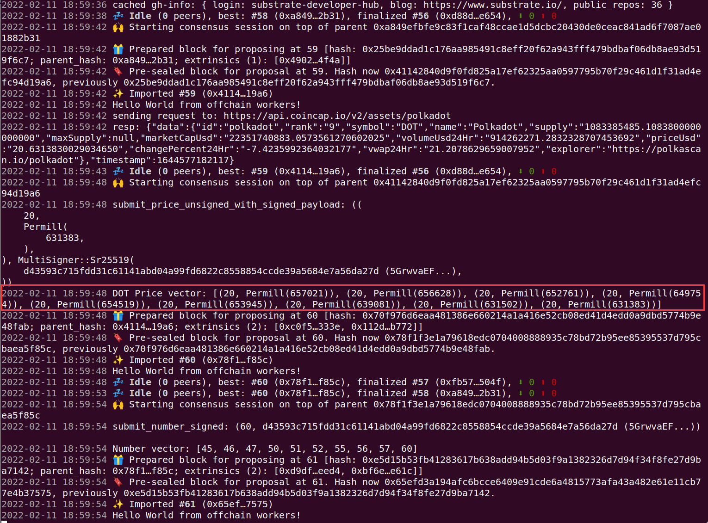

## 题目

以 ocw-example 为基础，把它拷到 assignment 目录里来修改，最后提交这个代码库。
利用 offchain worker 取出 DOT 当前对 USD 的价格，并把写到一个 Vec 的存储里，你们自己选一种方法提 交回链上，并在代码注释为什么用这种方法提交回链上最好。只保留当前最近的 10 个价格，其他价格可丢 弃 (就是 Vec 的⻓度⻓到 10 后，这时再插入一个值时，要先丢弃最早的那个值)。

## 执行结果

## 完整代码路径

https://github.com/jsrzxok/SubstrateCourseSlides/blob/hw04_ocw_jasonruan/04-ocw/ocw-example/pallets/ocw/src/lib.rs