# 作业：自己完成并部署一个erc20的智能合约

## 项目创建

```bash
cargo contract new erc20
```

## 合约开发

```rust
#![cfg_attr(not(feature = "std"), no_std)]

use ink_lang as ink;

#[ink::contract]
mod erc20 {
    use ink_storage::{collections::HashMap, lazy::Lazy};

    #[ink(storage)]
    pub struct Erc20 {
        /// The total supply.
        total_supply: Lazy<Balance>,
        /// The balance of each user.
        balances: HashMap<AccountId, Balance>,
        /// Approval spender on behalf of the message's sender.
        allowances: HashMap<(AccountId, AccountId), Balance>,
    }

    #[ink(event)]
    pub struct Transfer {
        #[ink(topic)]
        from: Option<AccountId>,
        #[ink(topic)]
        to: Option<AccountId>,
        #[ink(topic)]
        value: Balance,
    }

    #[ink(event)]
    pub struct Approval {
        #[ink(topic)]
        owner: AccountId,
        #[ink(topic)]
        spender: AccountId,
        #[ink(topic)]
        value: Balance,
    }

    #[derive(Debug, Eq, PartialEq, scale::Encode, scale::Decode)]
    #[cfg_attr(feature = "std", derive(scale_info::TypeInfo))]
    pub enum Error {
        InsufficientBalance,
        InsufficientApproval,
    }

    pub type Result<T> = core::result::Result<T, Error>;

    impl Erc20 {
        #[ink(constructor)]
        pub fn new(initial_supply: Balance) -> Self {
            let caller = Self::env().caller();
            let mut balances = HashMap::new();
            balances.insert(caller, initial_supply);

            Self::env().emit_event(Transfer {
                from: None,
                to: Some(caller),
                value: initial_supply,
            });

            Self {
                total_supply: Lazy::new(initial_supply),
                balances,
                allowances: HashMap::new(),
            }
        }

        #[ink(message)]
        pub fn total_supply(&self) -> Balance {
            *self.total_supply
        }

        #[ink(message)]
        pub fn balance_of(&self, who: AccountId) -> Balance {
            self.balance_of_or_zero(&who)
        }

        #[ink(message)]
        pub fn allowance(&self, owner: AccountId, spender: AccountId) -> Balance {
            self.allowance_of_or_zero(&owner, &spender)
        }

        #[ink(message)]
        pub fn transfer(&mut self, to: AccountId, value: Balance) -> Result<()> {
            let from = self.env().caller();
            self.transfer_from_to(from, to, value)
        }

        #[ink(message)]
        pub fn approve(&mut self, spender: AccountId, value: Balance) -> Result<()> {
            let owner = self.env().caller();
            self.allowances.insert((owner, spender), value);
            self.env().emit_event(Approval {
                owner,
                spender,
                value,
            });

            Ok(())
        }

        #[ink(message)]
        pub fn transfer_from(
            &mut self,
            from: AccountId,
            to: AccountId,
            value: Balance,
        ) -> Result<()> {
            let caller = self.env().caller();
            let allowance = self.allowance_of_or_zero(&from, &caller);
            if allowance < value {
                return Err(Error::InsufficientApproval);
            }

            self.transfer_from_to(from, to, value)?;
            self.allowances.insert((from, caller), allowance - value);

            Ok(())
        }

        fn transfer_from_to(
            &mut self,
            from: AccountId,
            to: AccountId,
            value: Balance,
        ) -> Result<()> {
            let from_balance = self.balance_of_or_zero(&from);
            if from_balance < value {
                return Err(Error::InsufficientBalance);
            }
            let to_balance = self.balance_of_or_zero(&to);
            self.balances.insert(from, from_balance - value);
            self.balances.insert(to, to_balance + value);
            self.env().emit_event(Transfer {
                from: Some(from),
                to: Some(to),
                value,
            });

            Ok(())
        }

        fn balance_of_or_zero(&self, who: &AccountId) -> Balance {
            *self.balances.get(who).unwrap_or(&0)
            // self.balances.get(who).copied().unwrap_or(0)
        }

        fn allowance_of_or_zero(&self, owner: &AccountId, spender: &AccountId) -> Balance {
            *self.allowances.get(&(*owner, *spender)).unwrap_or(&0)
            // self.allowances
            //     .get(&(*owner, *spender))
            //     .copied()
            //     .unwrap_or(0)
        }
    }
}
```

## 合约编译

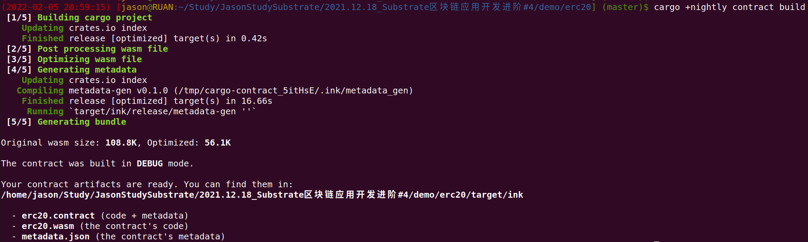

## 合约部署

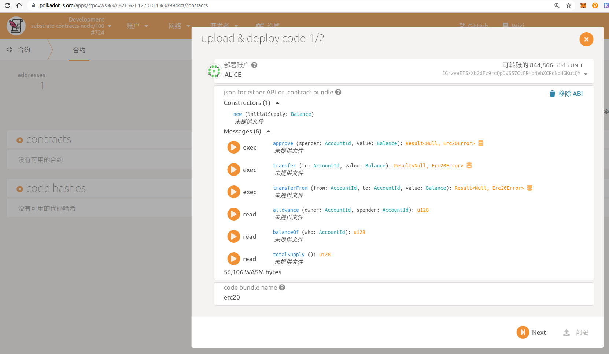

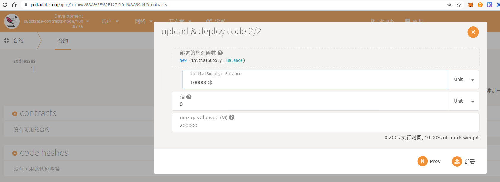

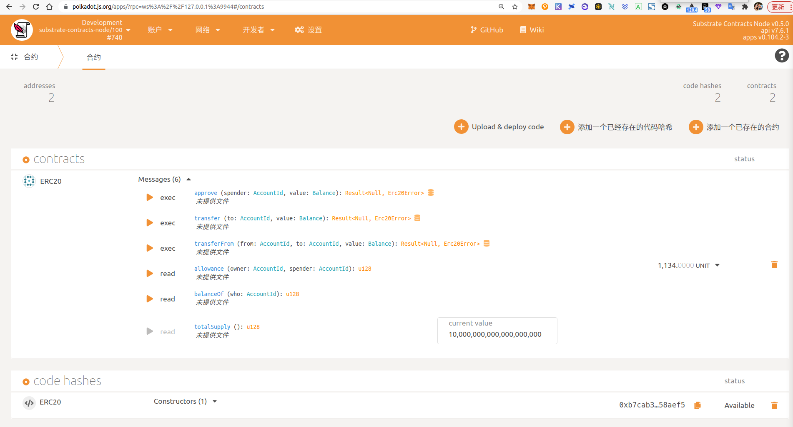

## 合约测试

### Alice余额查看

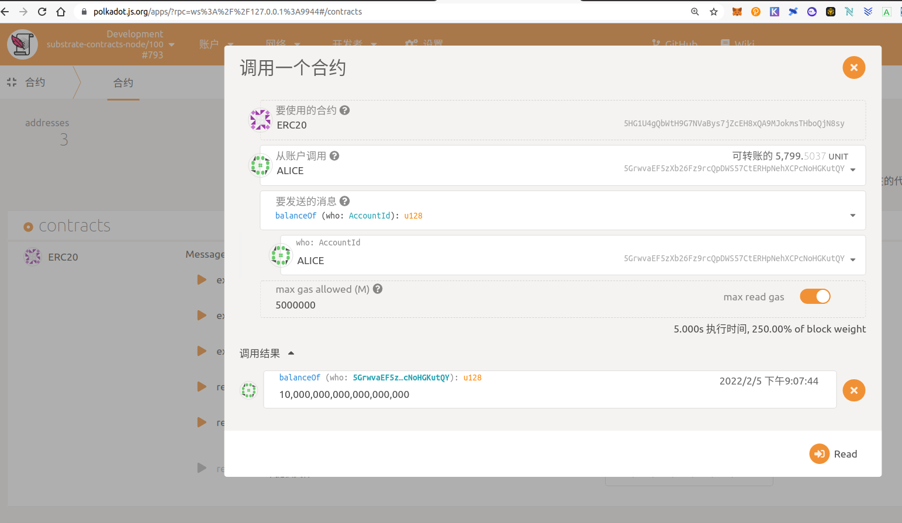

### Alice给Bob转账300

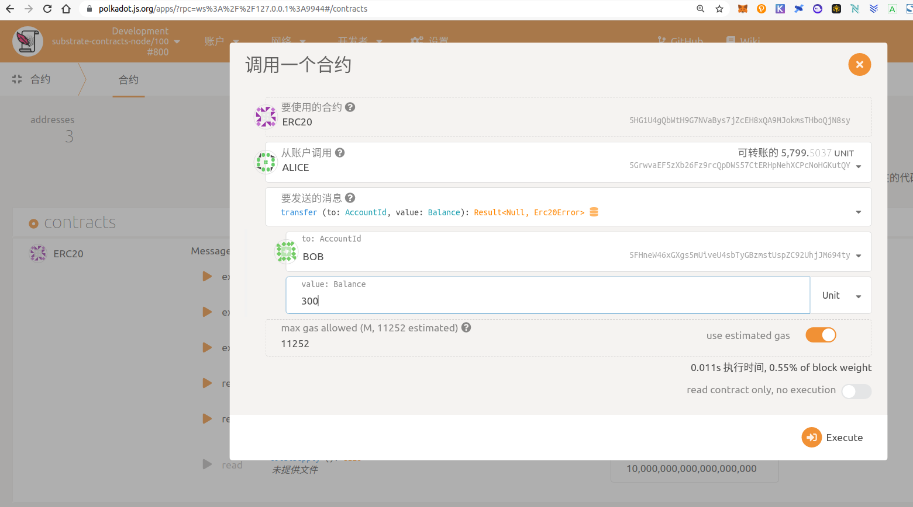

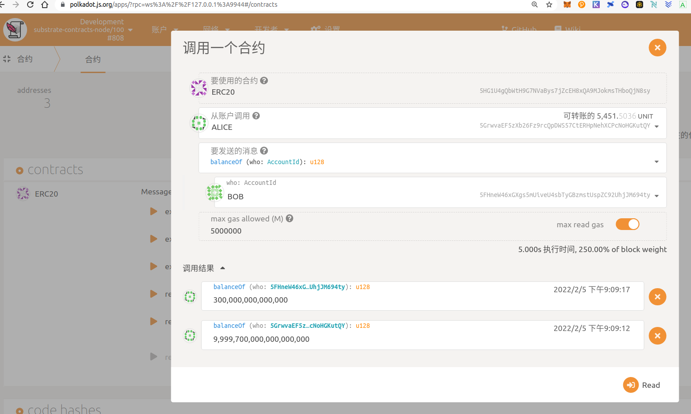

### Alice 授权 Eve 可以消费自己的 2000 代币

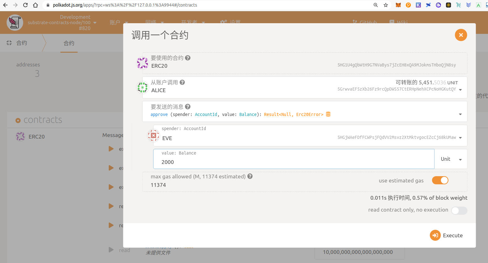

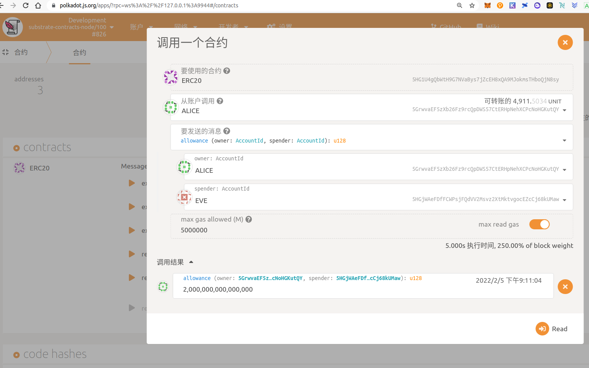

### Eve 给 Ferdie 转账 Alice 的 500 代币

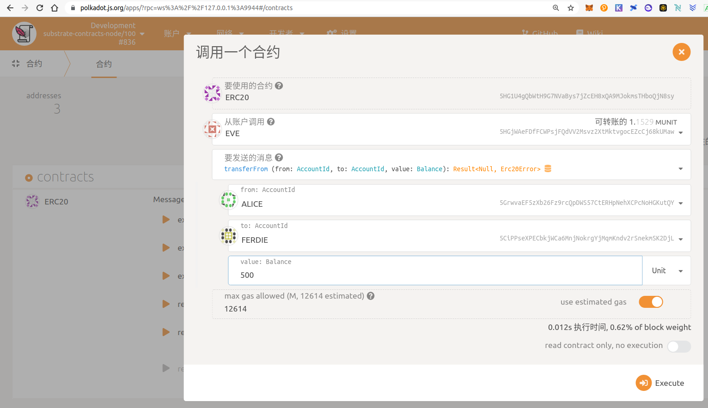

### 查看到 Ferdie 的代币数

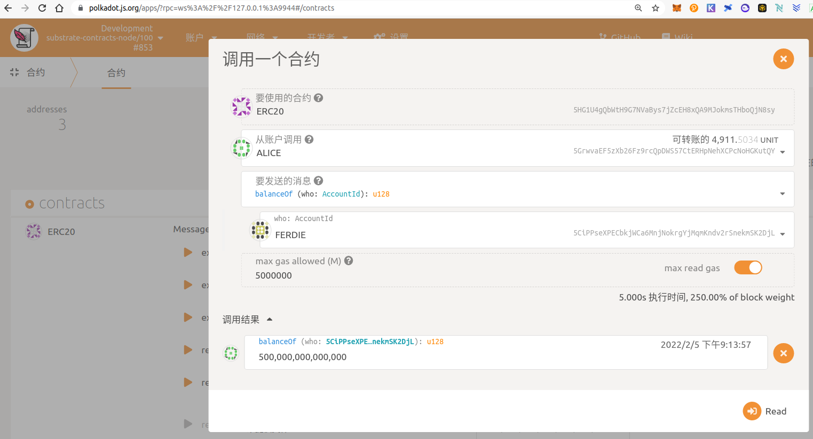

### 查看 Eve 剩余 Alice 的授权额度

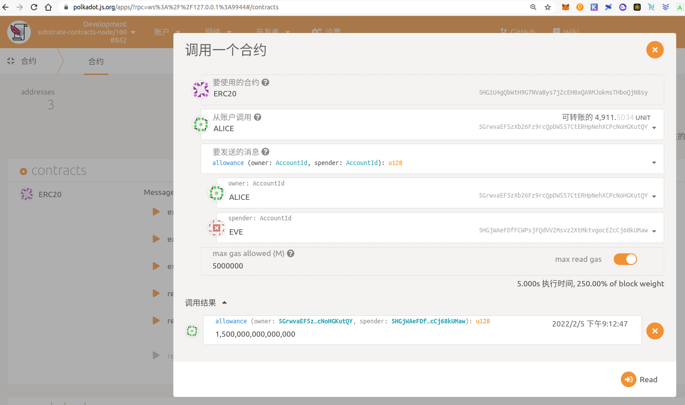

### Eve 再给 Ferdie 转账 Alice 的 2000 代币（超过额度）

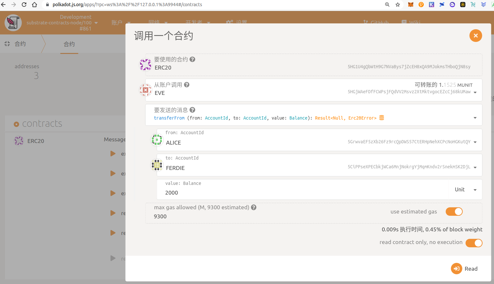

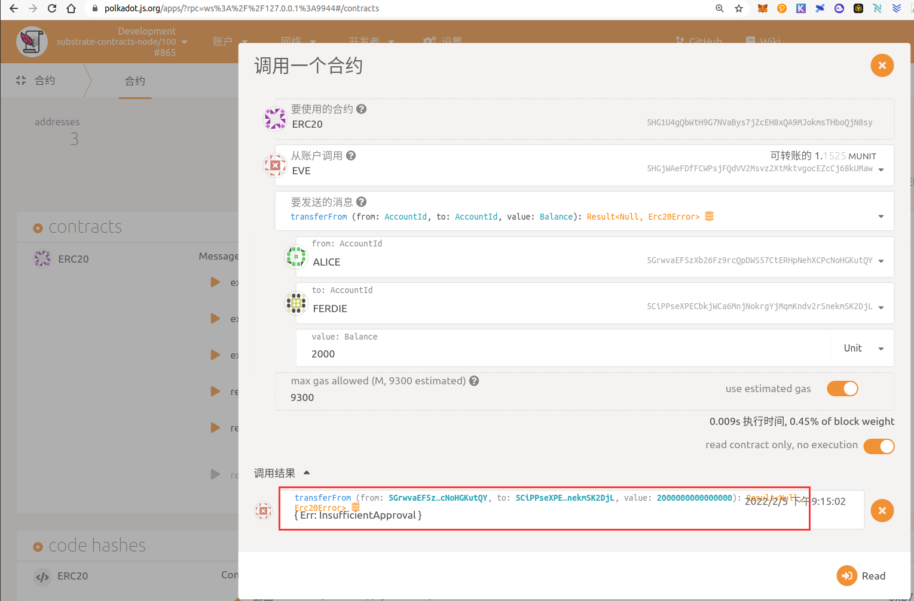

