## 1 为 template 模块的 do_something 添加 benchmark 用例（也可以是其它自选模块的可调用函数），并且将 benchmark 运行的结果转换为对应的权重定义

### 1.1 直接指定

#### 1.1.1 编译

> 注：需要使用`--features runtime-benchmarks`，否则执行`benchmark`会报如下错误：
>
> ```
> Error: Input("Benchmarking wasn't enabled when building the node. You can enable it with `--features runtime-benchmarks`.")
> ```

```bash
$ cargo build --release --features runtime-benchmarks
......
   Compiling node-template v3.0.0-monthly-2021-10 (/home/jason/Blockchain/Substrate/substrate-node-template/node)
    Finished release [optimized] target(s) in 17m 25s
```

#### 1.1.2 单测

```bash
$ cargo test -p pallet-template --all-features
```

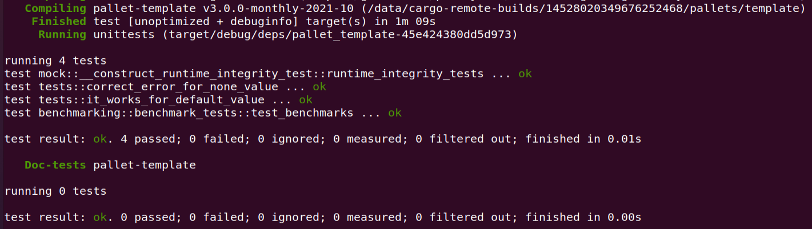

#### 1.1.3 运行

```bash
$ ./target/release/node-template benchmark --chain dev \
        --execution=wasm --wasm-execution=compiled --pallet pallet_template \
        --extrinsic do_something --steps 20 --repeat 50
```

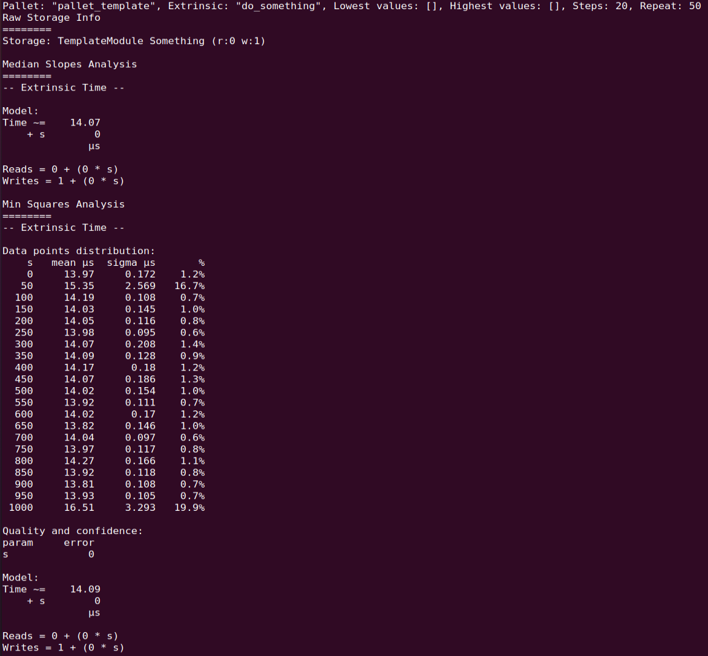

#### 1.1.4 权重指定

1μs => 1_000_000 weights，故将代码修改为：

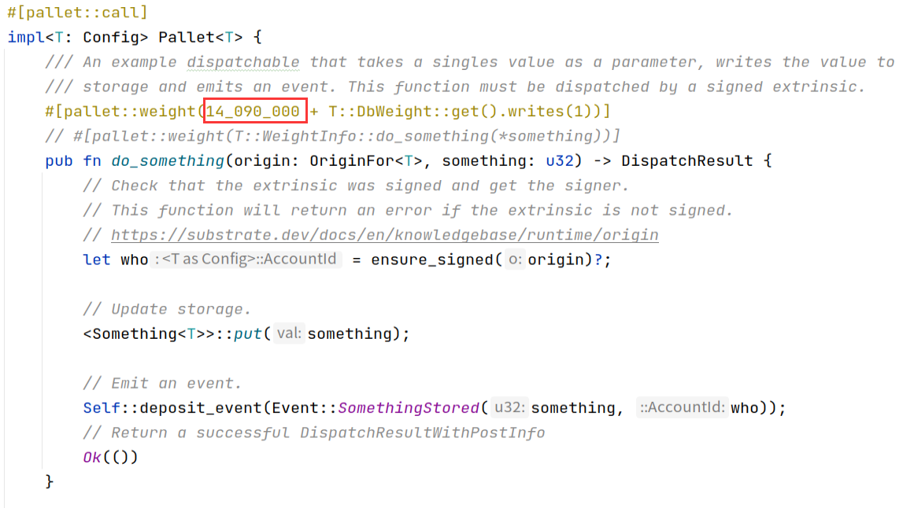

### 1.2 采用weights方式

#### 1.2.1 使用模板生成`weights.rs`

- **执行命令**

```bash
$ ./target/release/node-template benchmark --chain dev \
    --execution=wasm --wasm-execution=compiled \
    --pallet pallet_template --extrinsic do_something \
    --steps 20 --repeat 50 \
    --template ./.maintain/frame-weight-template.hbs \
    --output ./pallets/template/src/weights.rs 
```

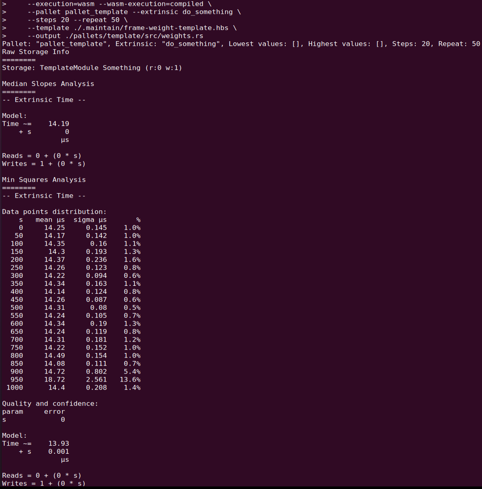

- **生成的weights文件**

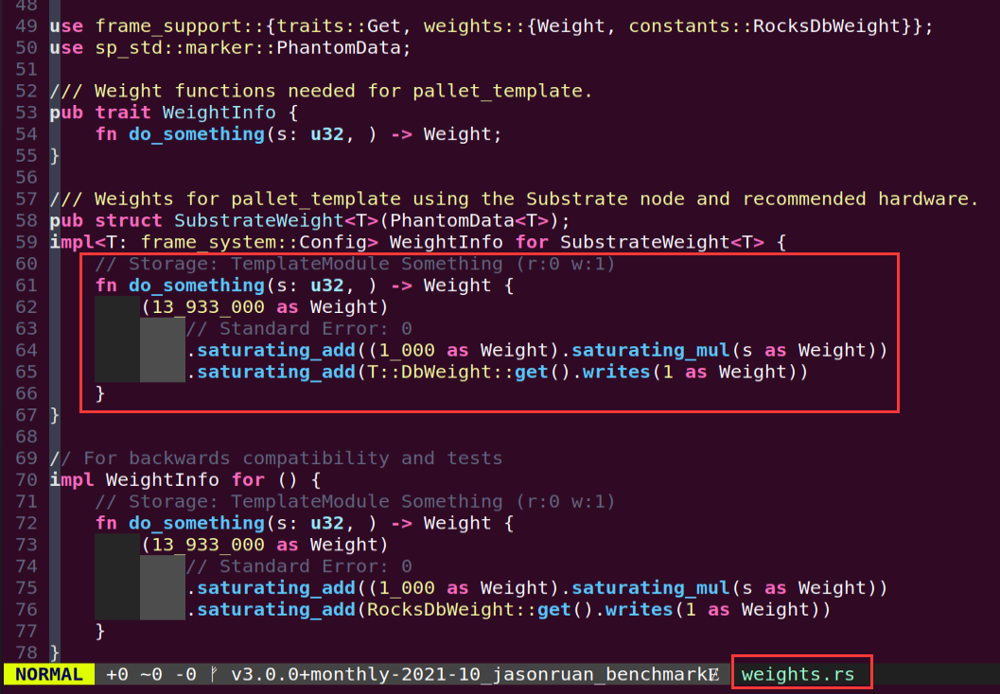

#### 1.2.2 使用weights指定权重

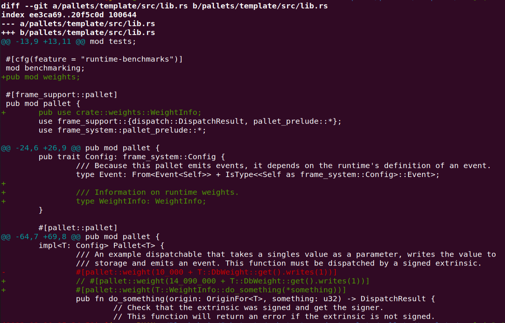

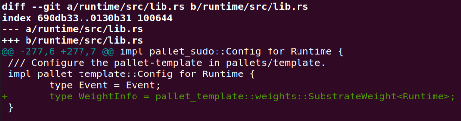

## 2 选择 node-template 或者其它节点程序，生成 Chain Spec 文件（两种格式都需要）

### 2.1 添加自定义spec

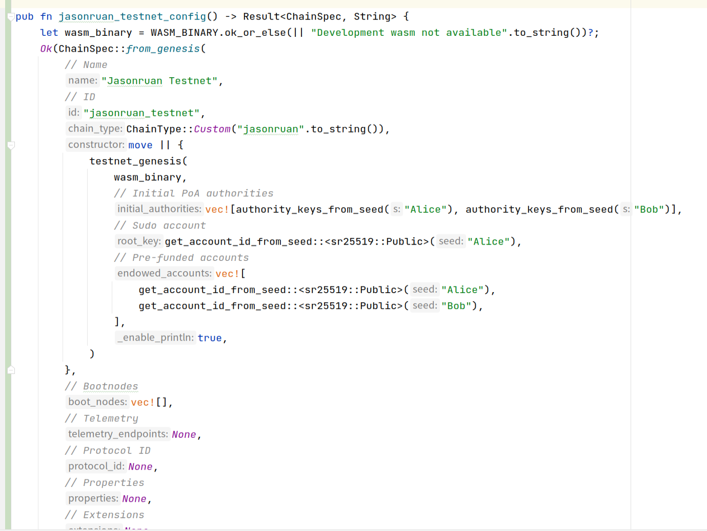

### 2.2 创建Keys

#### 2.2.1 生成助记词

```bash
$ ./target/release/node-template key generate --scheme Sr25519 --password-interactive
Key password: 
Secret phrase:       release vivid envelope urge vivid wrap garlic work hazard labor initial effort
  Secret seed:       0xbb481edc3c67e570564fb9ef3c9d72025bfe7f15b1d3eea90bb3cffc573d2fbd
  Public key (hex):  0x86159cfd077342f47d79494a61d2a5f70aa5f44f5c1d11837e270efde784343b
  Account ID:        0x86159cfd077342f47d79494a61d2a5f70aa5f44f5c1d11837e270efde784343b
  Public key (SS58): 5F6WhDV5mVGPFGkpECkGfFkJ6vcAGb1YiM4KeSwHCtgeoKpq
  SS58 Address:      5F6WhDV5mVGPFGkpECkGfFkJ6vcAGb1YiM4KeSwHCtgeoKpq
```

#### 2.2.2 创建Key Pair 1

> 注：用于区块生成的`Aura`账号需要使用`sr25519`，用于区块确认（`finalization`）的`GRANDPA`账号需要使用`ed25519`。

```bash
$ ./target/release/node-template key inspect --password-interactive --scheme Sr25519 "release vivid envelope urge vivid wrap garlic work hazard labor initial effort//jasonruan//aura"
Key password: 
Secret Key URI `release vivid envelope urge vivid wrap garlic work hazard labor initial effort//jasonruan//aura` is account:
  Secret seed:       0x5c2ad092f5a31367ac773e49581b3fc925ea70ff857499c7323216dab91179ef
  Public key (hex):  0x6e98c84ff8d4fcf4683a40f93d5cbba467a231eaf8c76a3509138691966d0d29
  Account ID:        0x6e98c84ff8d4fcf4683a40f93d5cbba467a231eaf8c76a3509138691966d0d29
  Public key (SS58): 5EZiWZ5PZDLBP1MxX5csuwnMYeY4rn2MxNfXUsCyK5WrzD6g
  SS58 Address:      5EZiWZ5PZDLBP1MxX5csuwnMYeY4rn2MxNfXUsCyK5WrzD6g

$ ./target/release/node-template key inspect --password-interactive --scheme Ed25519 "release vivid envelope urge vivid wrap garlic work hazard labor initial effort//jasonruan//grandpa"
Key password: 
Secret Key URI `release vivid envelope urge vivid wrap garlic work hazard labor initial effort//jasonruan//grandpa` is account:
  Secret seed:       0xeff64eda62ca07688f90c5eb61d2cfa5c5b6307a237a05ed62868534c9fc9138
  Public key (hex):  0xac655b08df9e9ddbbe3aa96d6a4a6d7a37d9f9e69329cc243801b53d605809c2
  Account ID:        0xac655b08df9e9ddbbe3aa96d6a4a6d7a37d9f9e69329cc243801b53d605809c2
  Public key (SS58): 5FxkCgZkxLjVKzN1WtrFJKuajyYNfvwYX91HsXYJa5XHmgxt
  SS58 Address:      5FxkCgZkxLjVKzN1WtrFJKuajyYNfvwYX91HsXYJa5XHmgxt

```

#### 2.2.3 创建Key Pair 2

```bash
$ ./target/release/node-template key inspect --password-interactive --scheme Sr25519 "release vivid envelope urge vivid wrap garlic work hazard labor initial effort//rzexin//aura"
Key password: 
Secret Key URI `release vivid envelope urge vivid wrap garlic work hazard labor initial effort//rzexin//aura` is account:
  Secret seed:       0x2998ef39d2cde117b6507ec187573f3cecd4dd119b264e115e0c8c9d8bf8394d
  Public key (hex):  0x863b08d941cdcf7bfa3c302a733efb9c352da71100ffe066396c7e45d939656b
  Account ID:        0x863b08d941cdcf7bfa3c302a733efb9c352da71100ffe066396c7e45d939656b
  Public key (SS58): 5F6hoyFC1LXxq2Cfkp6e2TjY49BJQCvCUfn99p9RSC5TjKPF
  SS58 Address:      5F6hoyFC1LXxq2Cfkp6e2TjY49BJQCvCUfn99p9RSC5TjKPF
  
$ ./target/release/node-template key inspect --password-interactive --scheme Ed25519 "release vivid envelope urge vivid wrap garlic work hazard labor initial effort//rzexin//grandpa"
Key password: 
Secret Key URI `release vivid envelope urge vivid wrap garlic work hazard labor initial effort//rzexin//grandpa` is account:
  Secret seed:       0x62a8665aeb677dd13200fc808265742a42ad2c5f8ec94b0eb74f228bc762e3c4
  Public key (hex):  0xc335e7c18f10cf52841c4cfeb837667f3e27080fbcfef6f083563b54481729ab
  Account ID:        0xc335e7c18f10cf52841c4cfeb837667f3e27080fbcfef6f083563b54481729ab
  Public key (SS58): 5GUfD1cditMdcR7phKNFyCseb8bPMWsZMpDFzzT8xPCMrDUE
  SS58 Address:      5GUfD1cditMdcR7phKNFyCseb8bPMWsZMpDFzzT8xPCMrDUE
```

### 2.3 创建用户自定义chain spec文件

#### 2.3.1 创建chain spec文件

```bash
$ ./target/release/node-template build-spec --disable-default-bootnode --chain jasonruan > jasonSpec.json
```

#### 2.3.2 修改chain spec文件

> 将`jasonSpec.json`文件中相关配置，改成前面创建的地址

```json
      "aura": {
        "authorities": [
          "5EZiWZ5PZDLBP1MxX5csuwnMYeY4rn2MxNfXUsCyK5WrzD6g",
          "5F6hoyFC1LXxq2Cfkp6e2TjY49BJQCvCUfn99p9RSC5TjKPF"
        ]
      },
      "grandpa": {
        "authorities": [
          [
            "5FxkCgZkxLjVKzN1WtrFJKuajyYNfvwYX91HsXYJa5XHmgxt",
            1
          ],
          [
            "5GUfD1cditMdcR7phKNFyCseb8bPMWsZMpDFzzT8xPCMrDUE",
            1
          ]
        ]
      },
      "balances": {
        "balances": [
          [
            "5EZiWZ5PZDLBP1MxX5csuwnMYeY4rn2MxNfXUsCyK5WrzD6g",
            1152921504606846976
          ],
          [
            "5F6hoyFC1LXxq2Cfkp6e2TjY49BJQCvCUfn99p9RSC5TjKPF",
            1152921504606846976
          ]
        ]
      },
      "sudo": {
        "key": "5EZiWZ5PZDLBP1MxX5csuwnMYeY4rn2MxNfXUsCyK5WrzD6g"
      } 
    } 
```

#### 2.3.3 创建chain spec raw文件

```bash
$ ./target/release/node-template build-spec --chain=jasonSpec.json --raw --disable-default-bootnode > jasonSpecRaw.json
2022-02-10 17:35:43 Building chain spec 
```

## 3 （附加题）根据 Chain Spec，部署公开测试网络

### 3.1 启动`Bootnode`节点

#### 3.1.1 执行启动命令

```bash
$ ./target/release/node-template purge-chain --base-path /tmp/jasonruan-bootnode01 --chain jasonruan -y
"/tmp/jasonruan-bootnode01/chains/jasonruan_testnet/db/full" removed.

$ ./target/release/node-template \
--base-path /tmp/jasonruan-bootnode01 \
--chain ./jasonSpecRaw.json \
--port 30333 \
--ws-port 9944 \
--rpc-port 9933 \
--validator \
--rpc-methods Unsafe \
--name jasonruan-BootNode01 

# --telemetry-url 'wss://telemetry.polkadot.io/submit/ 0' \
2022-02-10 17:37:06 Substrate Node    
2022-02-10 17:37:06 ✌️  version 3.0.0-monthly-2021-10-unknown-x86_64-linux-gnu    
2022-02-10 17:37:06 ❤️  by Substrate DevHub <https://github.com/substrate-developer-hub>, 2017-2022    
2022-02-10 17:37:06 📋 Chain specification: Jasonruan Testnet    
2022-02-10 17:37:06 🏷 Node name: jasonruan-BootNode01    
2022-02-10 17:37:06 👤 Role: AUTHORITY    
2022-02-10 17:37:06 💾 Database: RocksDb at /tmp/jasonruan-bootnode01/chains/jasonruan_testnet/db/full    
2022-02-10 17:37:06 ⛓  Native runtime: node-template-100 (node-template-1.tx1.au1)    
2022-02-10 17:37:07 🔨 Initializing Genesis block/state (state: 0x6664…c8f6, header-hash: 0x4a36…dffd)    
2022-02-10 17:37:07 👴 Loading GRANDPA authority set from genesis on what appears to be first startup.    
2022-02-10 17:37:07 ⏱  Loaded block-time = 6s from block 0x4a368f2c61b5ffe9099ff48faa105557c63eeb8a6ba0dbc5ef030916c8aedffd    
2022-02-10 17:37:07 Using default protocol ID "sup" because none is configured in the chain specs    
2022-02-10 17:37:07 🏷 Local node identity is: 12D3KooWKGALSwem2D16pDpBAL4FCAvBhcMYQKnmNZA1aCSLCchR    
2022-02-10 17:37:07 📦 Highest known block at #0    
2022-02-10 17:37:07 〽️ Prometheus exporter started at 127.0.0.1:9615    
2022-02-10 17:37:07 Listening for new connections on 127.0.0.1:9944.    
2022-02-10 17:37:12 💤 Idle (0 peers), best: #0 (0x4a36…dffd), finalized #0 (0x4a36…dffd), ⬇ 0 ⬆ 0    
2022-02-10 17:37:17 💤 Idle (0 peers), best: #0 (0x4a36…dffd), finalized #0 (0x4a36…dffd), ⬇ 0 ⬆ 0    
2022-02-10 17:37:22 💤 Idle (0 peers), best: #0 (0x4a36…dffd), finalized #0 (0x4a36…dffd), ⬇ 0 ⬆ 0    
2022-02-10 17:37:27 💤 Idle (0 peers), best: #0 (0x4a36…dffd), finalized #0 (0x4a36…dffd), ⬇ 0 ⬆ 0    
```

启动后，我们并未看到有区块产生，还需要执行下面的操作。

接下来我们需要把我们创建的`keys`添加到该节点的`keystore`里面，这步操作在后续每个网络节点部署时都必不可少。

#### 3.1.2 添加`keys`到`keystore`

- 添加aura1

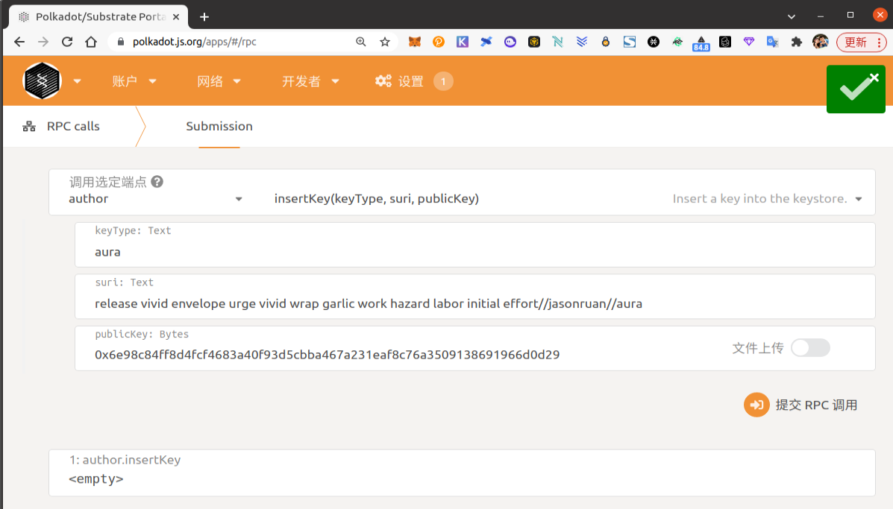

```json
./target/release/node-template key insert --base-path /tmp/jasonruan-bootnode01 \
--chain jasonSpecRaw.json \
--scheme Sr25519 \
--suri 'release vivid envelope urge vivid wrap garlic work hazard labor initial effort//jasonruan//aura' \
--password-interactive \
--key-type aura
```

- 添加grandpa1

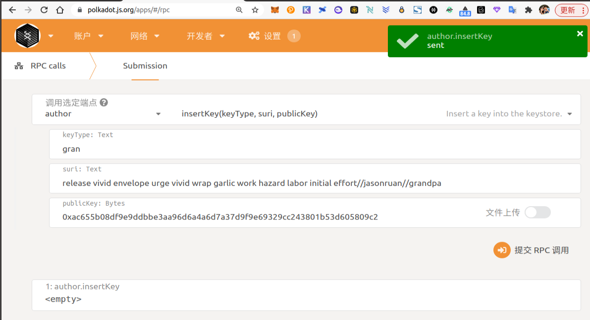

```json
./target/release/node-template key insert --base-path /tmp/jasonruan-bootnode01 \
--chain jasonSpecRaw.json \
--scheme Ed25519 \
--suri "release vivid envelope urge vivid wrap garlic work hazard labor initial effort//jasonruan//grandpa" \
--password-interactive \
--key-type gran
```

- 查看私钥文件

```bash
$ ls /tmp/jasonruan-bootnode01/chains/jasonruan_testnet/keystore/
617572616e98c84ff8d4fcf4683a40f93d5cbba467a231eaf8c76a3509138691966d0d29  6772616eac655b08df9e9ddbbe3aa96d6a4a6d7a37d9f9e69329cc243801b53d605809c2
```

### 3.2 添加验证人节点

#### 3.2.1 执行启动命令

```bash
$ ./target/release/node-template purge-chain --base-path /tmp/jasonruan-validator01 --chain jasonruan -y

$ ./target/release/node-template \
--base-path /tmp/jasonruan-validator01 \
--chain ./jasonSpecRaw.json \
--port 30334 \
--ws-port 9945 \
--rpc-port 9934 \
--validator \
--rpc-methods Unsafe \
--name jasonruan-Validator01 \
--bootnodes /ip4/127.0.0.1/tcp/30333/p2p/12D3KooWAi8dfXVhwCXHFkzgo67Vr9h5TsHUPh2uCU5X7UivQvSv

# --telemetry-url "wss://telemetry.polkadot.io/submit/ 0" \
2022-02-10 17:44:15 Substrate Node    
2022-02-10 17:44:15 ✌️  version 3.0.0-monthly-2021-10-unknown-x86_64-linux-gnu    
2022-02-10 17:44:15 ❤️  by Substrate DevHub <https://github.com/substrate-developer-hub>, 2017-2022    
2022-02-10 17:44:15 📋 Chain specification: Jasonruan Testnet    
2022-02-10 17:44:15 🏷 Node name: jasonruan-Validator01    
2022-02-10 17:44:15 👤 Role: AUTHORITY    
2022-02-10 17:44:15 💾 Database: RocksDb at /tmp/jasonruan-validator01/chains/jasonruan_testnet/db/full    
2022-02-10 17:44:15 ⛓  Native runtime: node-template-100 (node-template-1.tx1.au1)    
2022-02-10 17:44:15 🔨 Initializing Genesis block/state (state: 0x6664…c8f6, header-hash: 0x4a36…dffd)    
2022-02-10 17:44:15 👴 Loading GRANDPA authority set from genesis on what appears to be first startup.    
2022-02-10 17:44:16 ⏱  Loaded block-time = 6s from block 0x4a368f2c61b5ffe9099ff48faa105557c63eeb8a6ba0dbc5ef030916c8aedffd    
2022-02-10 17:44:16 Using default protocol ID "sup" because none is configured in the chain specs    
2022-02-10 17:44:16 🏷 Local node identity is: 12D3KooWStS5obGXg348LArRQi6qet6TEA1sKwpSCYscCvoRjiEu    
2022-02-10 17:44:16 📦 Highest known block at #0    
2022-02-10 17:44:16 Listening for new connections on 127.0.0.1:9945.    
2022-02-10 17:44:16 🔍 Discovered new external address for our node: /ip4/127.0.0.1/tcp/30334/p2p/12D3KooWStS5obGXg348LArRQi6qet6TEA1sKwpSCYscCvoRjiEu    
2022-02-10 17:44:20 📪 No longer listening on /ip6/fe80::d0e6:bbff:fea8:439c/tcp/30334    
2022-02-10 17:44:21 💤 Idle (1 peers), best: #0 (0x4a36…dffd), finalized #0 (0x4a36…dffd), ⬇ 0.8kiB/s ⬆ 0.8kiB/s   
```

#### 3.2.2 添加`keys`到`keystore`

- 添加aura2

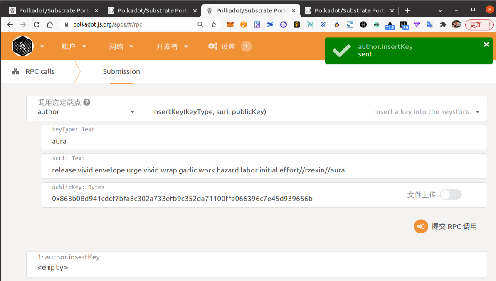

```json
./target/release/node-template key insert --base-path /tmp/jasonruan-validator01 \
--chain jasonSpecRaw.json \
--scheme Sr25519 \
--suri "release vivid envelope urge vivid wrap garlic work hazard labor initial effort//rzexin//aura" \
--password-interactive \
--key-type aura
```

- 添加grandpa2

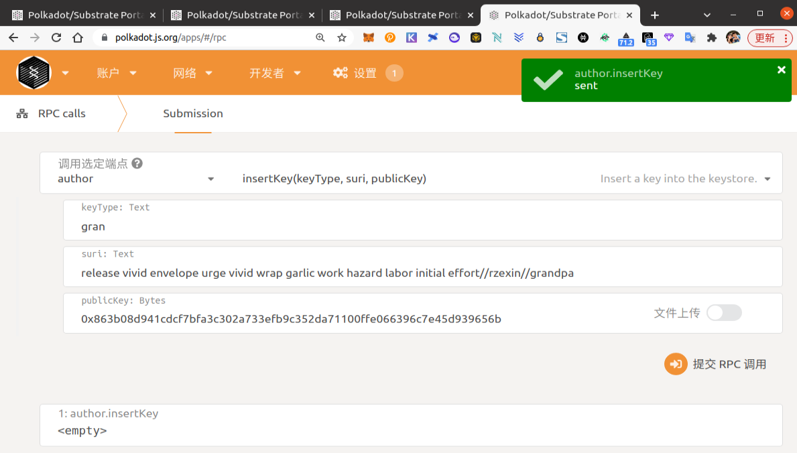

```json
./target/release/node-template key insert --base-path /tmp/jasonruan-validator01 \
--chain jasonSpecRaw.json \
--scheme Ed25519 \
--suri "release vivid envelope urge vivid wrap garlic work hazard labor initial effort//rzexin//grandpa" \
--password-interactive \
--key-type gran
```

### 3.3 重启节点

> 启动报错，尚未解决。
>
> ```
> 2022-02-10 18:10:04 GRANDPA voter error: Signing("Failed to sign GRANDPA vote for round 1 targetting 0x4a368f2c61b5ffe9099ff48faa105557c63eeb8a6ba0dbc5ef030916c8aedffd")    
> 2022-02-10 18:10:04 Essential task `grandpa-voter` failed. Shutting down service.    
> Error: Service(Other("Essential task failed."))
> ```

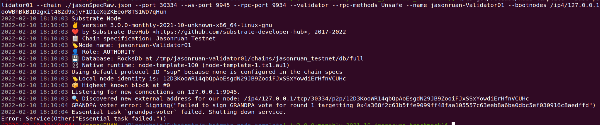
