## 常见错误汇总

### associated type `AccountId` not found

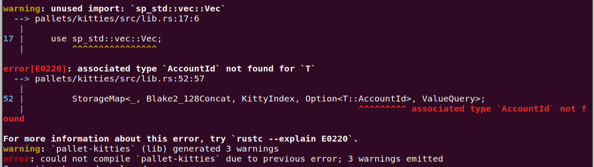

加上这个：

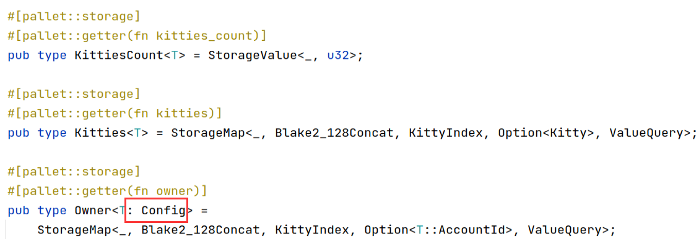

### the trait `TypeInfo` is not implemented for `Kitty`

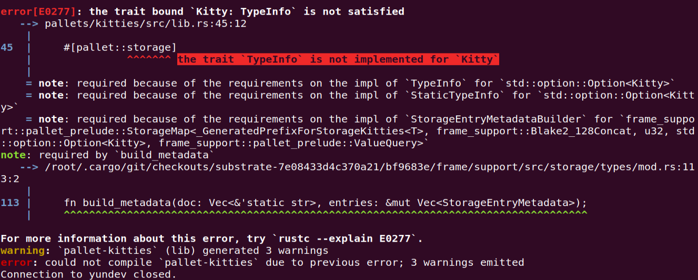

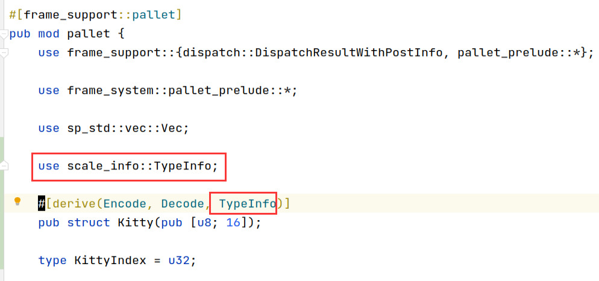

### use of undeclared crate or module `sp_io`

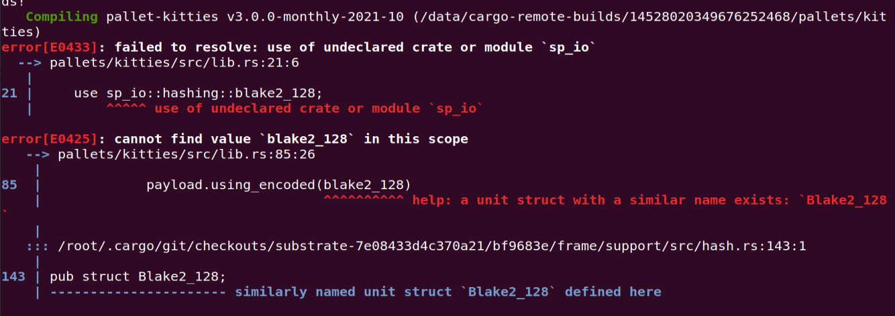

复制并添加：

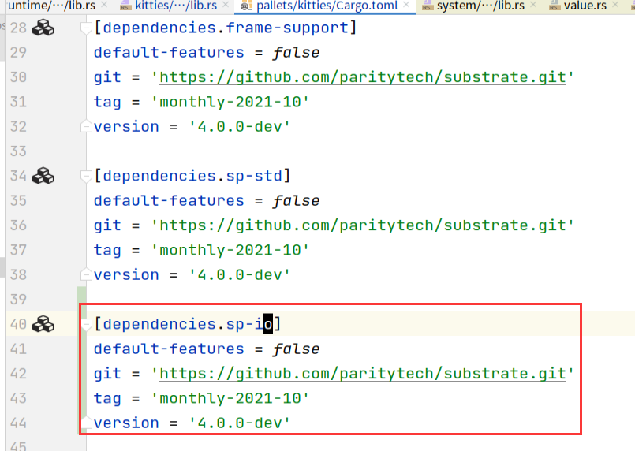

### associated type `Randomness` not found

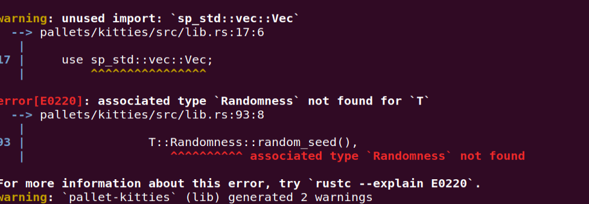

### cannot find trait `Randomness` in this scope

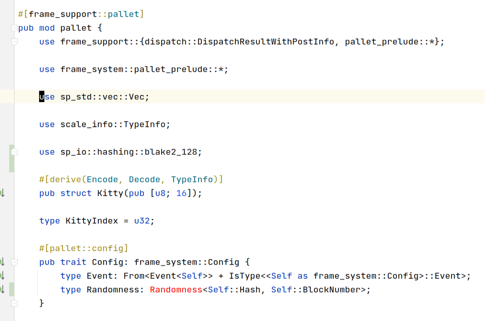

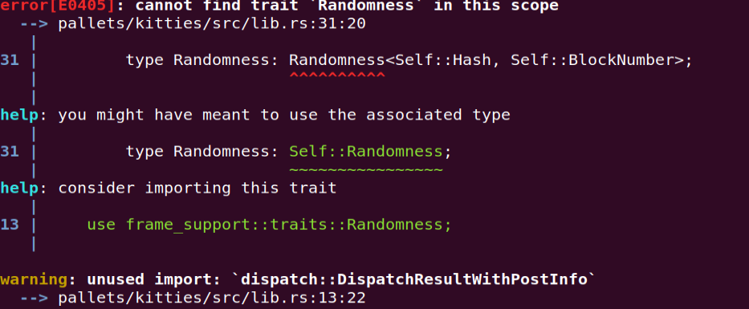

解法：

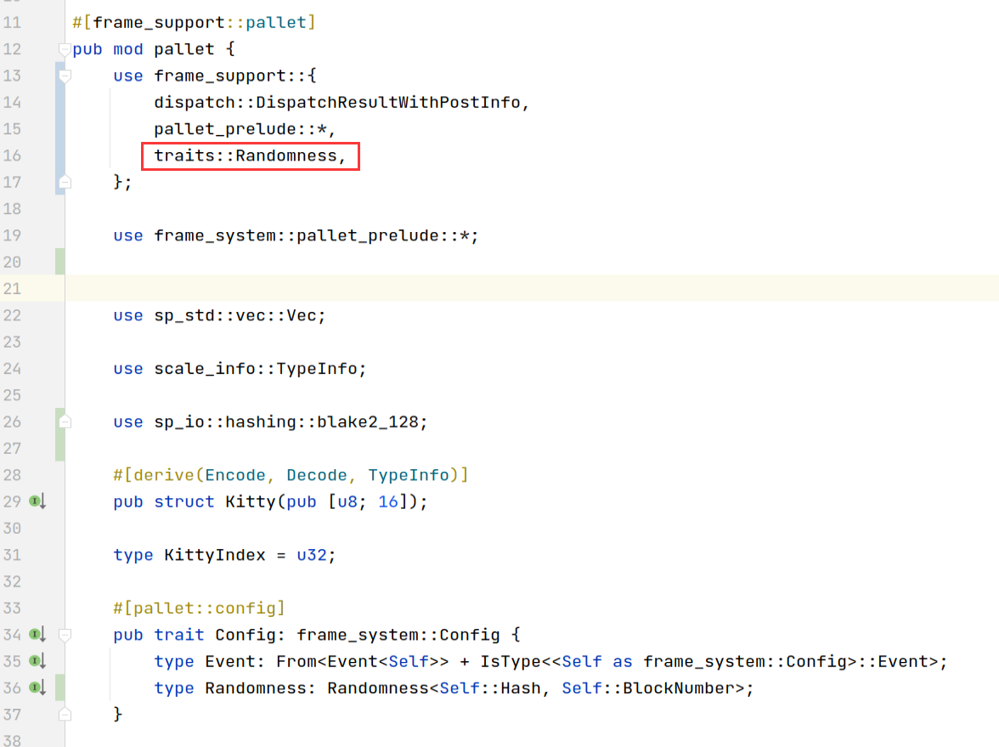

### use of undeclared type `Currency`

### not found in `Config`

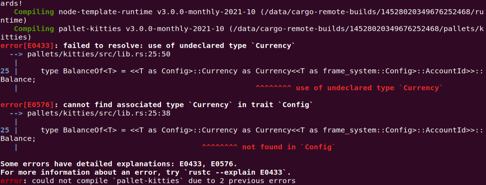

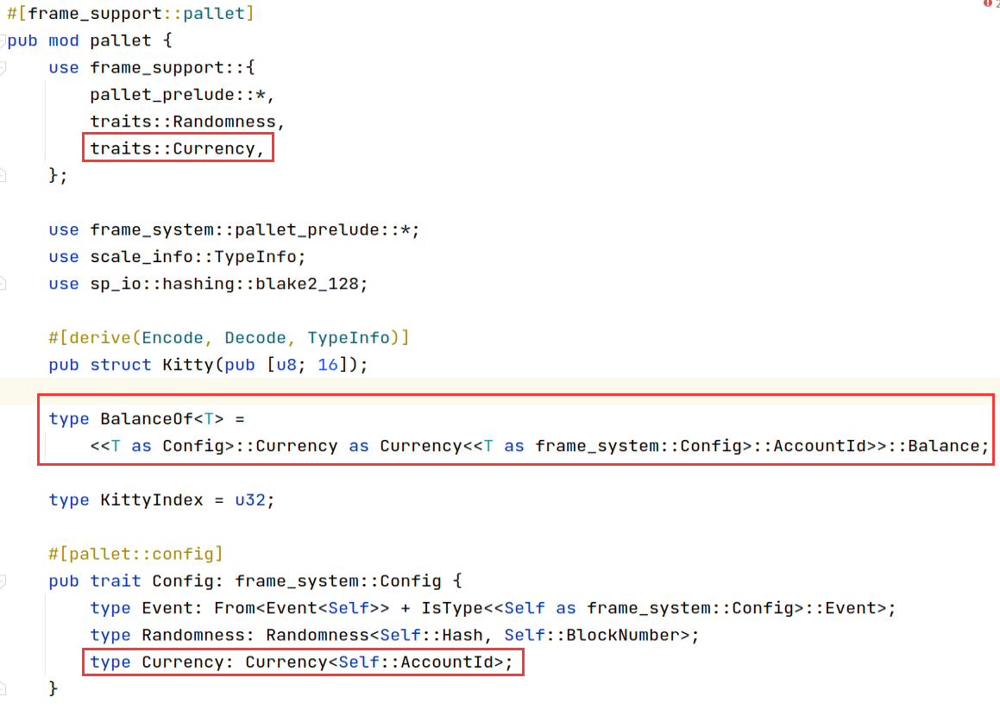

### missing `Currency` in implementation

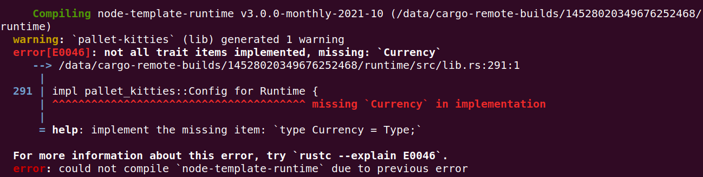

