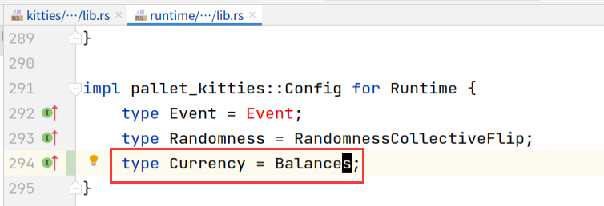

## 常见错误汇总

### associated type `AccountId` not found

加上这个：

### the trait `TypeInfo` is not implemented for `Kitty`

### use of undeclared crate or module `sp_io`

复制并添加：

### associated type `Randomness` not found

### cannot find trait `Randomness` in this scope

解法：

### use of undeclared type `Currency`

### not found in `Config`

### missing `Currency` in implementation

